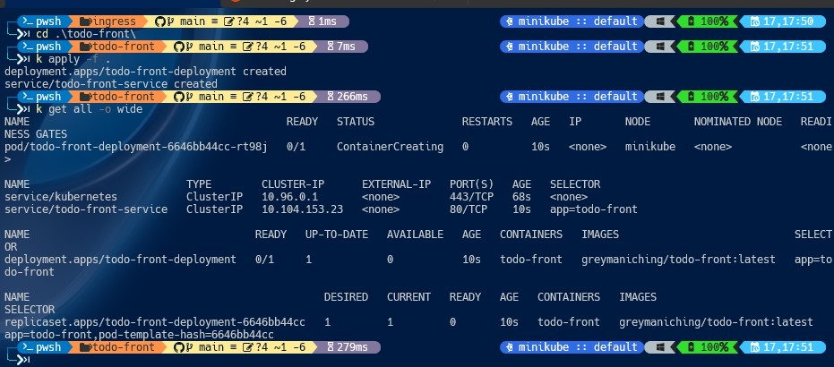
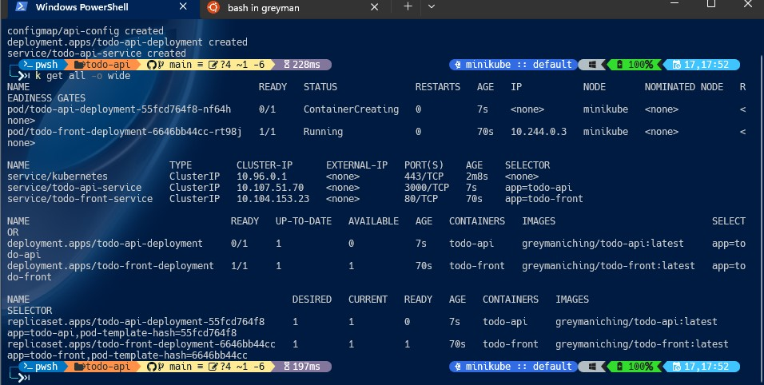
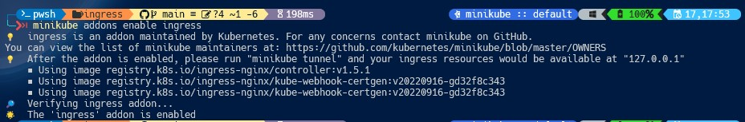
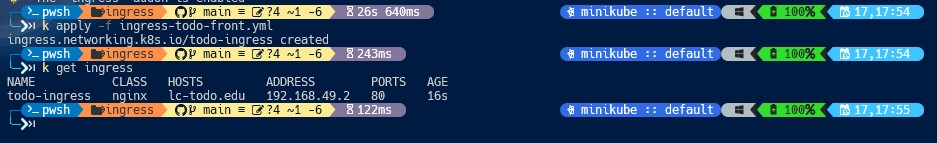
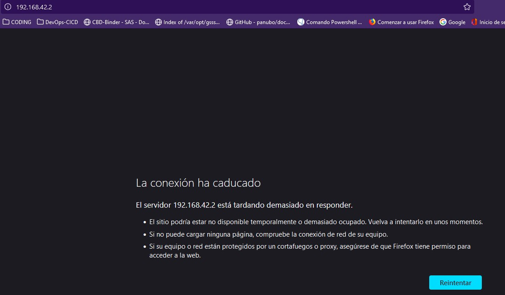
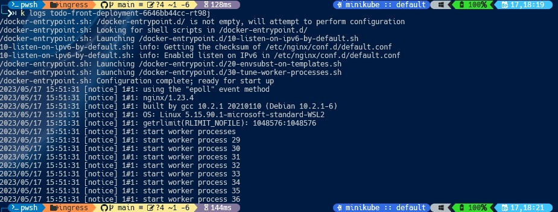

# Solución y resolución de issues encontrados en el ejercicio 2 Ingress todo-front.

Siguiendo los pasos del ejercicio Ingress, he desglosado el mismo en tres pasos:

## 1) Crear todo-front:

   * Un deployment cuya imagen Docker fue generada y cargada a Docker Hub
   * Un Servicio
   * Ejecutar `k apply -f . `

- **Evidencia 1** - 

   Una vez aplicados los manifiestos el ` k apply -f . ` procedo a generar la base de datos con:

## 2) Crear todo-api:

   Siguiendo los pasos

   * Un deployment
   * Un servicio
   * Un configMap
   * Ejecutar `k apply -f . `

   - **Evidencia 2** - 

## 2) Crear el servicio ingress con Nginx para Minikube

Configurando el NGINX Ingress Controller

`minikube addons enable ingress`

- **Evidencia 3** - 

verificar que el ingress está habilitado

`k get pods -n ingress-nginx`

- **Evidencia 4** - 

## Issues encontrados:

   Al ejecutar la ip en el navegador no aparece, es como que el servicio está siendo refused en algún momento.

- **Evidencia 4** - 

### Intentos de resolución:

   - * Reinstalar un nuevo Cluster de Minikube `minikube delete` y `minikube start --driver=docker`
   - * Verificar logs de los pods
   - * Verificando reglas firewall, tampoco es el problema.

- **Evidencia 5** - 
- **Evidencia 6** - 