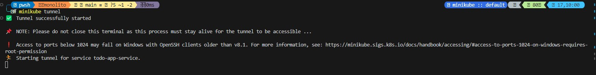
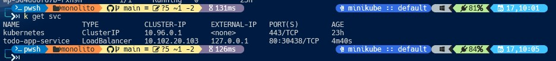
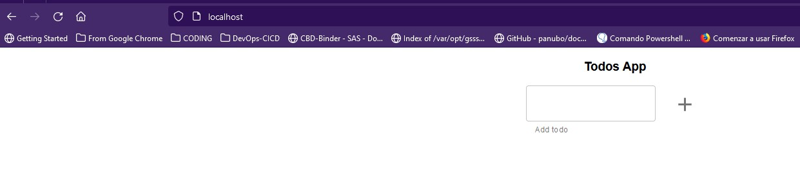

# Solución y resolución de issues encontrados en el ejercicio 1 Monolito en Memoria.

## Planteamiento del Problema

El objetivo era desplegar una aplicación monolítica en memoria, una aplicación TODO, en un clúster de Kubernetes. La aplicación incluía una interfaz de usuario y una API, ambas contenidas en un contenedor Docker. La persistencia de los datos se realizaba en memoria, por lo que los datos se perdían al apagar la aplicación.

## Problemas Encontrados

- **Error al construir la imagen Docker**: El proceso de construcción fallaba al ejecutar `npm run build` durante la construcción de la imagen Docker.
- **Error con la versión de Webpack**: El error de construcción se debía a un problema de compatibilidad con la versión de Webpack. Hubo que actualizarlo a la 5.21.0.
- **Error ImagePullBackOff en Kubernetes**: Al intentar desplegar la aplicación en Kubernetes, se producía un error de ImagePullBackOff y el pod no podía iniciar.
- **Error al extraer la imagen Docker**: Analizando el problema con `kubectl describe pod todo-app-668f5d4968-5pmsf` encontré que el error ImagePullBackOff se debía a:

   - ** Minikube (kubectl) no podía extraer la imagen Docker de la caché local. Para solucionar el problema de configuración entre Minikube y Docker, utilicé el comando minikube docker-env | Invoke-Expression en PowerShell para configurar el entorno Docker para usar el daemon Docker dentro de Minikube.
   - ** Error en que la imagen no existía en el repositorio de Docker Hub. Subí la imagen a Docker Hub para poder tenerla dispobible desde cualquier parte. Lo suyo sería administrarla desde un repositorio privado e incluir las credenciales de login del repo en un secret en kubernetes. Pero se complicaba la solución del ejercicio. Aplicando un 80-20.

- **Problema de configuración entre Minikube y Docker**: Existía un problema de configuración que impedía a Minikube acceder a las imágenes de Docker en local.

## Conclusión y Solución

La solución al ejercicio implicó varios pasos. Primero, resolví el problema de construcción de la imagen Docker actualizando la versión de Webpack a la 5.21.0. Luego, solucioné el error ImagePullBackOff publicando la imagen en Docker Hub para que Kubernetes pudiera acceder a ella. 

Finalmente, creé ulos dos manifiestos uno para el deployment y el otro para el servicio de LoadBalancer y poder acceder externamente al interface del usuario. Ejecutando el comando `kubectl apply -f .` para desplegar la solución completa.

El servicio la clave reside en la parte de ` port: 80 y targetPort: 3000 ` haciendo posible que se pueda acceder externamente a la aplicación.

Con estas soluciones, logré desplegar la aplicación TODO en un clúster de Kubernetes utilizando Minikube y Docker.

### Evidencias de la Solución

- **Evidencia 1** - 

- **Evidencia 2** - 

- **Evidencia 3** - 

