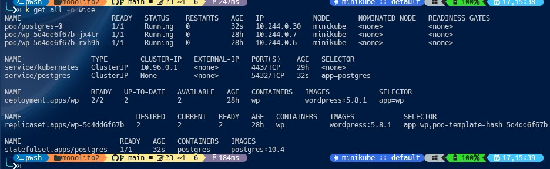
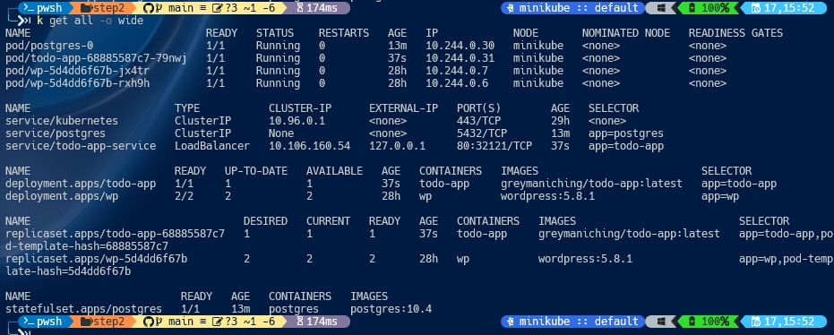
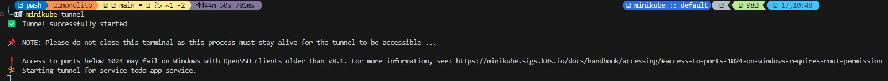
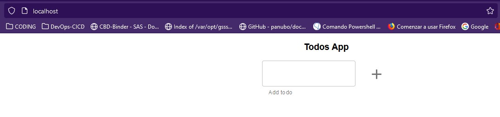

# Solución y resolución de issues encontrados en el ejercicio 2 Monolito Persistente.

Siguiendo los pasos del ejercicio2, he desglosado el mismo en dos pasos:

## 1) Creción de los manifiestos Postgres_DB:

   * Un ConfigMap
   * Un Storeclass
   * Un PersistentVolume y su PersistentVolumeClaim
   * Un Cluster IP service
   * Y finalmente el StatefulSet para incluyendo las variables definidas en el configmap y apuntando al PersistentVolumeClaim.

- **Evidencia 1** - 

   Una vez aplicados los manifiestos el ` k apply -f . ` procedo a generar la base de datos con:

   ### 1.1) Creación de la Postgres DB:
   Siguiendo los pasos

   * Ejecutamos kubectl get pods, y obtenemos el nombre del pod relacionado con el 
      StatefulSet.
   * Ejecutamos kubectl exec [postgres-pod-name] -it bash 
   * Ejecutamos psql -U postgres, pegamos todo-app/todos_db.sql y pulsamos enter, la 
      base de datos debería estar generada.

   - **Evidencia 2** - 

## 2) Step2 >> Crear todo app:

Siguiendo los mismos pasos que en el anterior ejercicio, añadiendo en el manifiesto deployment las variables de entorno para que coja la persistencia de postgres DB.

- **Evidencia 3** - 

- **Evidencia 4** - 

- **Evidencia 5** - 