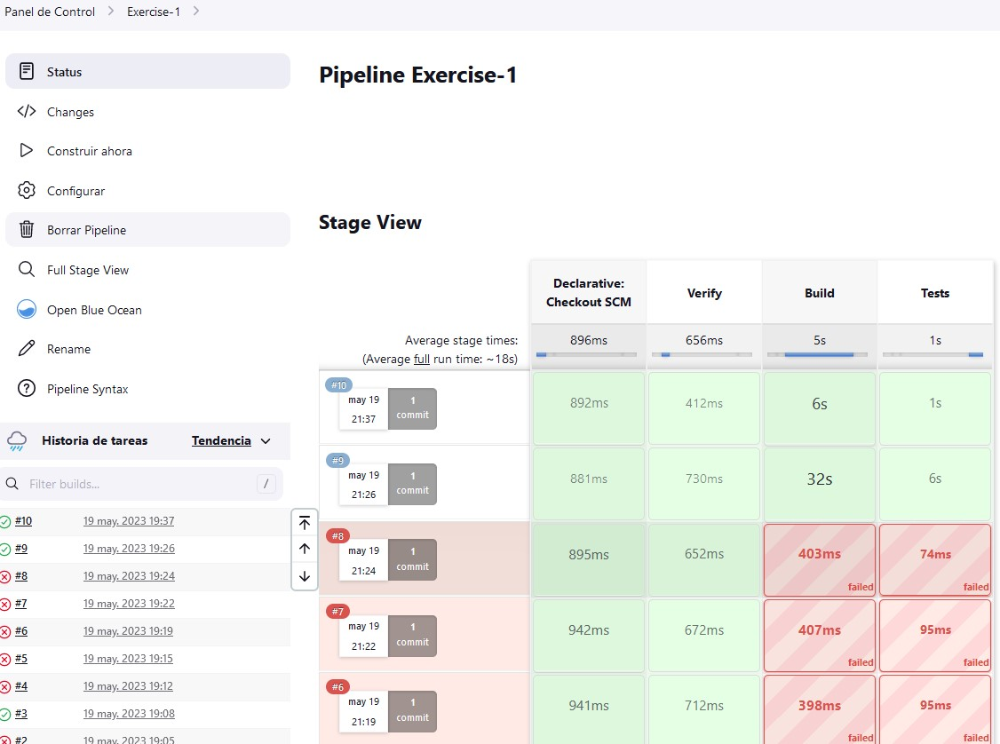
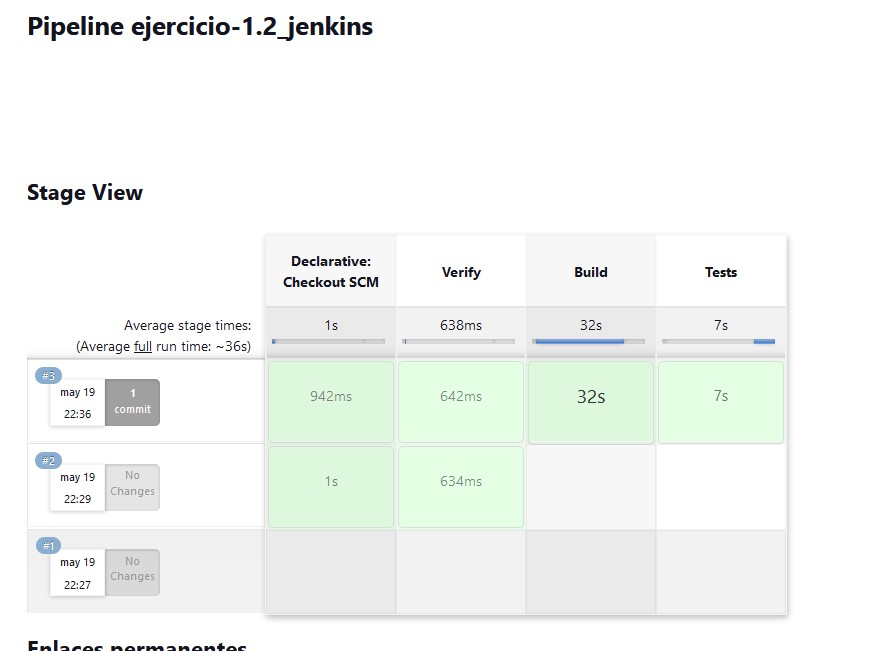

# CICD con Jenkins.


## 1) CI/CD de una Java + Gradle:

-   Checkout: Al configurar un pipeline con SCM, este mismo genera el checkout en el directorio temporal que usa jenkins.
- * Primer error: Al crear un checkout descargando el repo desde un stage.
        ```pipeline {
            agent any

            stages {
                stage('Checkout') {
                    steps {
                        git 'https://github.com/Lemoncode/bootcamp-devops-lemoncode.git'
                    }
                }
        ```
- * Segundo error: Como se puede comprobar realicé un checkout de un repo erróneo, ya que la carpeta exercise está en el mío. Esto provocó que el repo se quedara en caché y por tanto me volví loco porque no encontraba el path para ejecutar el build y el test. Recordé luego, el video4 donde se indica que GHActions no cachea, como lo hace Jenkins o Gitlab.

-   Build: En este stage, se debe compilar el código fuente utilizando el comando `./gradlew compileJava.`

- * Múltiples errores para garantizar la ejecución de gradlew. No encontrar el path correcto, olvidar dar permisos de ejecución, etc...

-   Unit Tests: En este último stage, se deben ejecutar los test unitarios, utilizando el comando `./gradlew test.`

- **Evidencia 1** - 

## 2) Modificar la pipeline para que utilice la imagen Docker de Gradle como build runner:

- Comprobado que los plugins [docker] y [docker-pipeline] están instalados por defecto en Jenkins.

- * Un único error de typo: faltaba un "}" de cierre. Añado la extensión YAML Red Hat en VSCode.

- Creo el agent = docker y añado la imagen `gradle:6.6.1-jre14-openj9`

- Genero un stage de verificación y lo ejecuto para comprobar si está correctamente instalado todo lo necesario. Y verificar las variables de entorno disponibles.

- Utilizo el mismo patrón de stages para build y test, modificando el path relativo añadiendo la variable $WORKSPACE para asegurarme que estoy en el path correcto dentro de docker.


- **Evidencia 2** -   