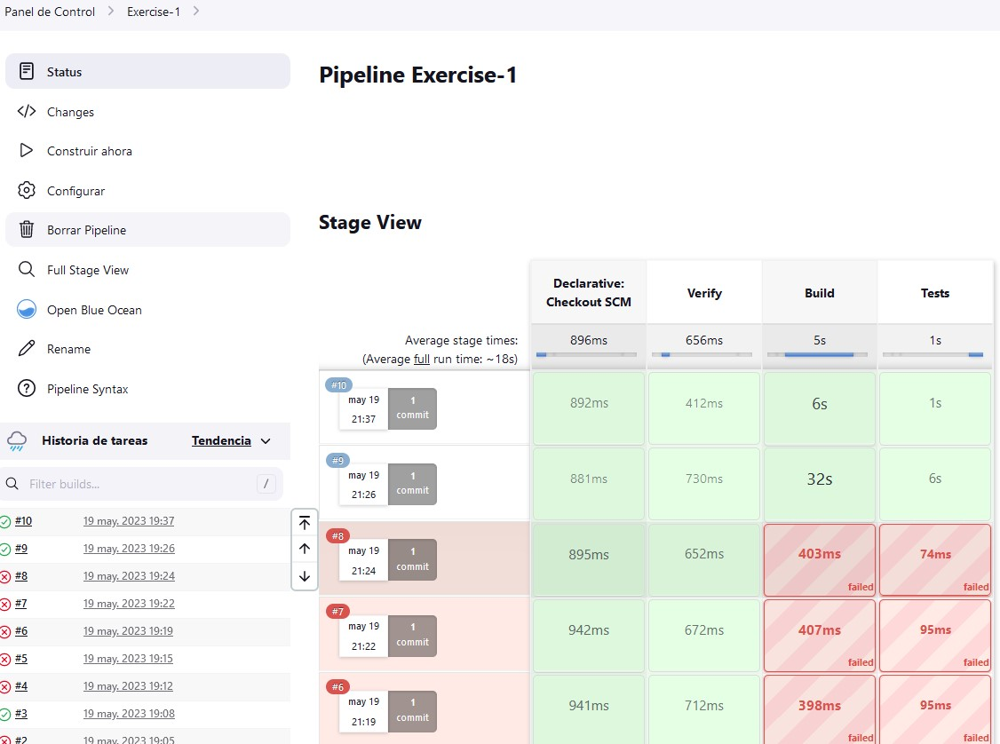
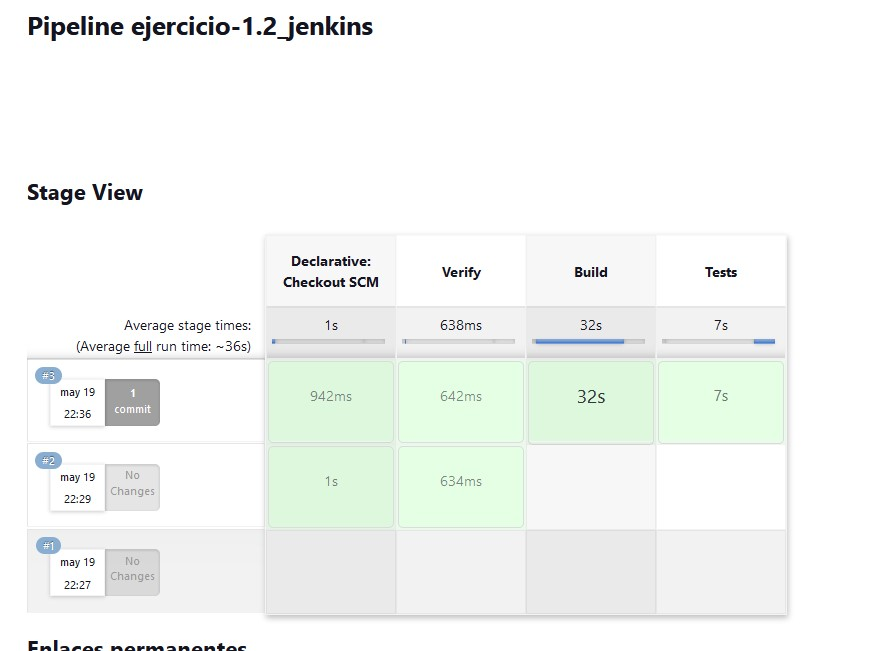
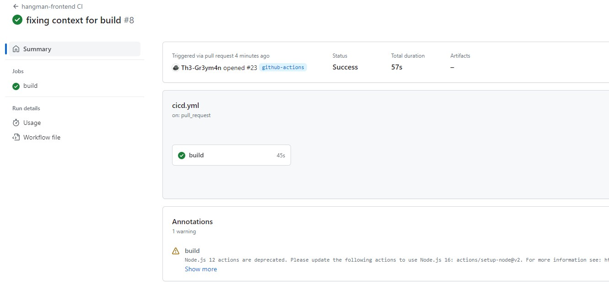
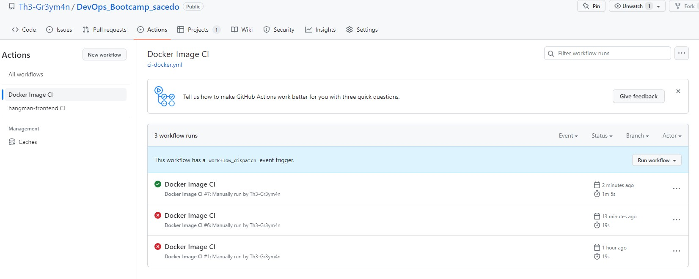
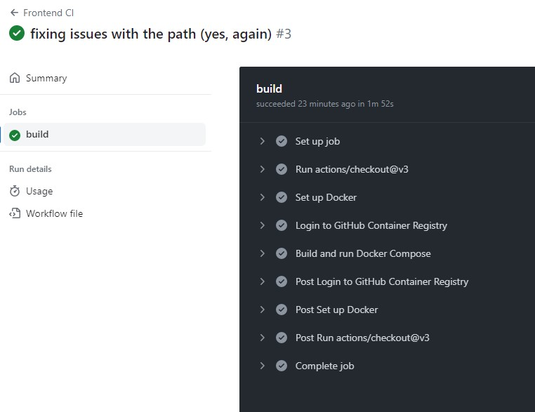
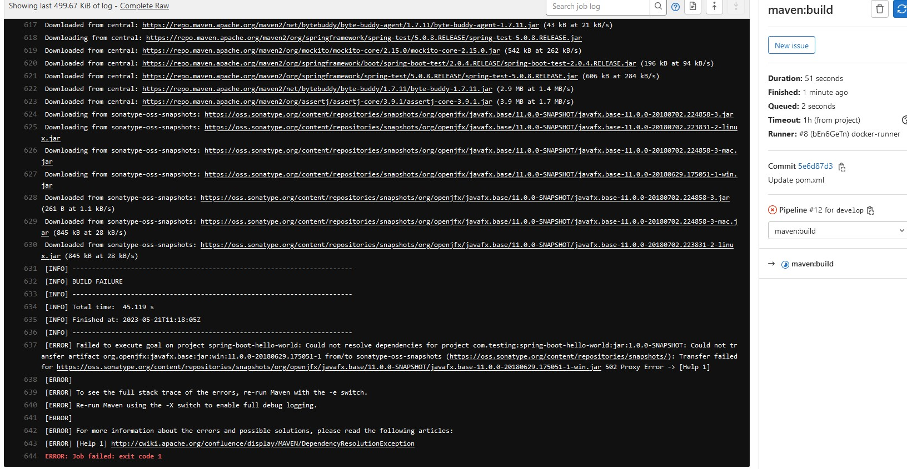
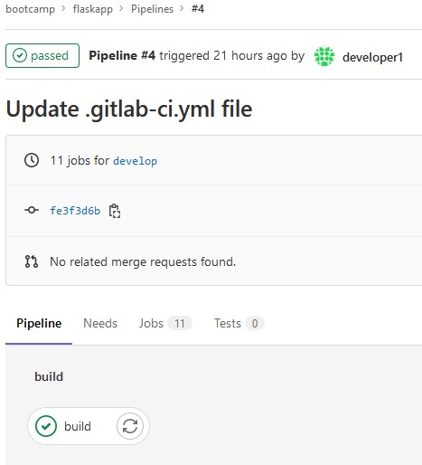
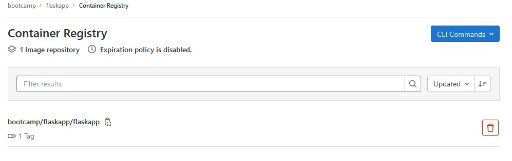
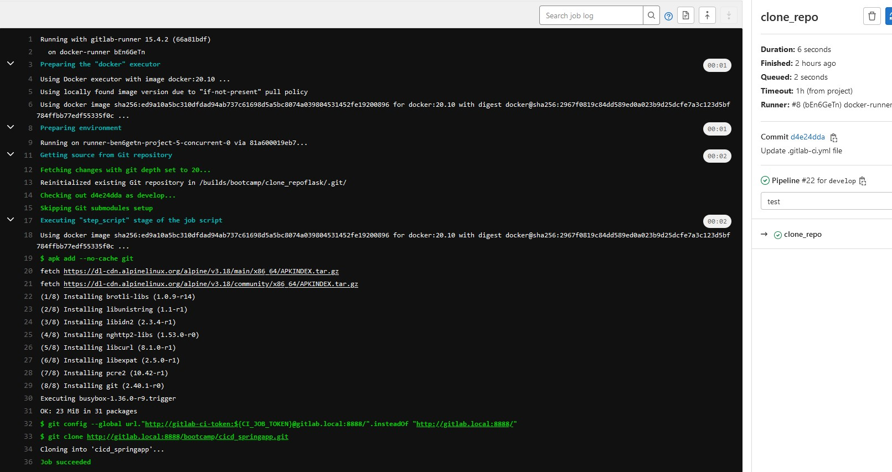
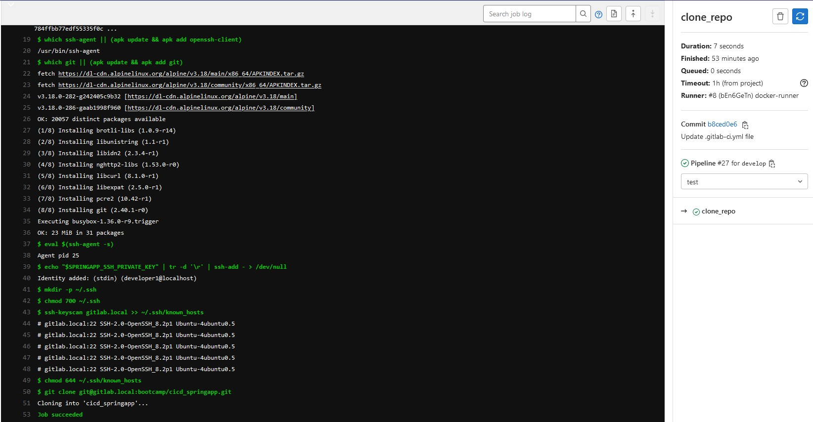

# CICD con Jenkins.


## 1) CI/CD de una Java + Gradle:

**NOTA: ir a la rama `developer2`**

-   Checkout: Al configurar un pipeline con SCM, este mismo genera el checkout en el directorio temporal que usa jenkins.
- * Primer error: Al crear un checkout descargando el repo desde un stage.
        ```pipeline {
            agent any

            stages {
                stage('Checkout') {
                    steps {
                        git 'https://github.com/Lemoncode/bootcamp-devops-lemoncode.git'
                    }
                }
        ```
- * Segundo error: Como se puede comprobar realicé un checkout de un repo erróneo, ya que la carpeta exercise está en el mío. Esto provocó que el repo se quedara en caché y por tanto me volví loco porque no encontraba el path para ejecutar el build y el test. Recordé luego, el video4 donde se indica que GHActions no cachea, como lo hace Jenkins o Gitlab.

-   Build: En este stage, se debe compilar el código fuente utilizando el comando `./gradlew compileJava.`

- * Múltiples errores para garantizar la ejecución de gradlew. No encontrar el path correcto, olvidar dar permisos de ejecución, etc...

-   Unit Tests: En este último stage, se deben ejecutar los test unitarios, utilizando el comando `./gradlew test.`

- **Evidencia 1** - 

## 2) Modificar la pipeline para que utilice la imagen Docker de Gradle como build runner:

**NOTA: ir a la rama `developer2`**

- Comprobado que los plugins [docker] y [docker-pipeline] están instalados por defecto en Jenkins.

- * Un único error de typo: faltaba un "}" de cierre. Añado la extensión YAML Red Hat en VSCode.

- Creo el agent = docker y añado la imagen `gradle:6.6.1-jre14-openj9`

- Genero un stage de verificación y lo ejecuto para comprobar si está correctamente instalado todo lo necesario. Y verificar las variables de entorno disponibles.

- Utilizo el mismo patrón de stages para build y test, modificando el path relativo añadiendo la variable $WORKSPACE para asegurarme que estoy en el path correcto dentro de docker.


- **Evidencia 2** -   


# GitHub Actions

## Ejercicio 1. Crea un workflow CI para el proyecto de frontend

Se crea un workflow en el que contruimos el entorno para buildear y testar la app hangman front `cicd.yml` se puede ver en la rama `github-actions`.

- **Evidencia 1** - 

- Problemas surgidos:

    - * intenté añadir un filtro (para que solo se lanzara si la carpeta hangman-front se modificaba), pero es complejo y no se activaba el wf. Tuve que eliminar el filtro.
    - * Errores con el Path para llegar al jest.js

## Ejercicio 2. Crea un workflow CD para el proyecto de frontend

Se crea un workflow en el que construyo una imagen docker y la pulleamos al ghcr.io [Github Container Registry] `ci-docker.yml` se puede ver en la rama `github-actions`.

- **Evidencia 2** - 

- Problemas surgidos:

    - * Cree de nuevo el entorno para buildear y testar (copy & paste) del yaml anterior.
    - * Errores con el path "./hangman-front/Dockerfile"

## Ejercicio 3. Crea un workflow que ejecute tests e2e

Se crea un Dockerfile `github/Dockerfile` con la estructura necesaria para instalar npm, build el código y crear la entrada CMD para lanzar el test en un contenedor. 

- **Evidencia 3** - 

- Problemas surgidos:

    - * cambio el docker-compose por docker compose command.
    - * Errores con el path "./hangman-front/docker-compose.yml"


# GitLab

## Ejericio 1. CI/CD de una aplicación spring:

- * Se crea el repo y el proyecto para la app springapp.
- * Se carga el código fuente usando `git clone git@gitlab.local:bootcamp/cicd_springapp.git` y abriendo VSCode `code .` creando un `git push` a la rama develop.
- * Se crea la pipeline ver en el repo springapp/.gitlab-ci.yml.

Errores no sin poder corregir:

- * La compilación ha generado un error: `[ERROR] Failed to execute goal org.springframework.boot:spring-boot-maven-plugin:2.0.4.RELEASE:repackage (default) on project spring-boot-hello-world: Execution default of goal org.springframework.boot:spring-boot-maven-plugin:2.0.4.RELEASE:repackage failed: Unable to find main class -> [Help 1]` Que aún buscando como resolver el error, no he podido resolverlo. Por tanto los stages de build, test, docker y deploy no he podido sacarlo:

**Evidencia 1** - .

-   * No obstante, con la finalidad de hacer un deployment de una imagen y utilizar el registry de Gitlab, lo hice con la aplicaciçon flaskapp. Usando este código:

```stages:
  - build


build:
  stage: build
  before_script:
    - docker login -u $CI_REGISTRY_USER -p $CI_JOB_TOKEN $CI_REGISTRY/$CI_PROJECT_PATH
  script:
    - echo $CI_REGISTRY $CI_REGISTRY_USER $CI_REGISTRY_PASSWORD
    - docker build -t $CI_REGISTRY/$CI_PROJECT_PATH/flaskapp:$CI_COMMIT_SHA . 
    - docker push $CI_REGISTRY/$CI_PROJECT_PATH/flaskapp:$CI_COMMIT_SHA
```

**Evidencia 1.1** 
- .

- .


## Ejericio 2. Crear un usuario nuevo

- **Guest**
 - * Commit: No
 - * Ejecutar pipeline manualmente: NO
 - * Push and pull del repo: No
 - * Merge request: No
 - * Acceder a la administración del repo: No

 - **Reporter**
 - * Commit: No
 - * Ejecutar pipeline manualmente: NO
 - * Push and pull del repo: No
 - * Merge request: No
 - * Acceder a la administración del repo: No

  - **developer**
 - * Commit: Si
 - * Ejecutar pipeline manualmente: Si
 - * Push and pull del repo: Si
 - * Merge request: Si
 - * Acceder a la administración del repo: No

  - **Maintainer**
 - * Commit: Si
 - * Ejecutar pipeline manualmente: Si
 - * Push and pull del repo: Si
 - * Merge request: Si
 - * Acceder a la administración del repo: Si


## Ejericio 3. Crear un nuevo repositorio que clone otro proyecto, springapp. 

- **Método CI job permissions model:**

- * ver `.gitlab-ci.yml`
**Evidencia 3** - .

Si no se es miembro del grupo del repo orígen, dará un error el Job como que las credenciales no las resuelve al no tener acceso al repo. Puede dar lugar a enteder ese error, o que hay un typo en el url del gitlab service. Es el mismo error.

- **Método deploy keys:**

- * ver `.gitlab-ci1.yml`
**Evidencia 3** - .